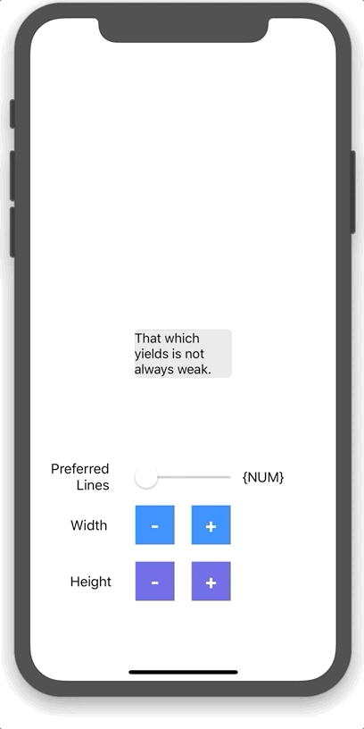
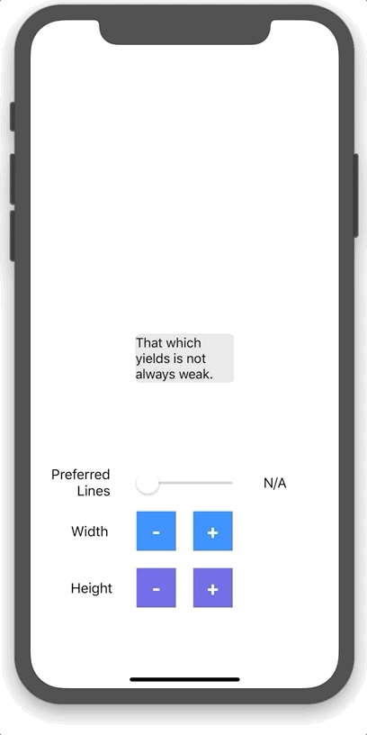

<h1 align="center">FontFit</h1>

<p align="center">
  
  
  
  
</p>

<p align="center">
    
    
</p>

## Purpose
FontFit adjusts the `font` size of a view (i.e. `UILabel` or `UITextView`) to fill it's container.

FontFit is the missing inverse of `sizeToFit()`. The `FontFit` extensions are a more detailed implementation of UILabel's [adjustsFontSizeToFitWidth](https://developer.apple.com/documentation/uikit/uilabel/1620546-adjustsfontsizetofitwidth) which only _reduces_ font size.

## Examples
**Note**: A full example use case can be found in the _Example_ project.

```Swift
let label = UILabel(frame: ...)

// Increase font to fill the label's frame.
label.fitTextToBounds()
```

```Swift
let label = UILabel(frame: ...)

// Increase font to fill the label's frame, attempting to distribute onto, at most, 2 lines.
label.fitText(maxLines: 2)
```
## License
FontFit is available under the MIT license. See the LICENSE file for more info.
